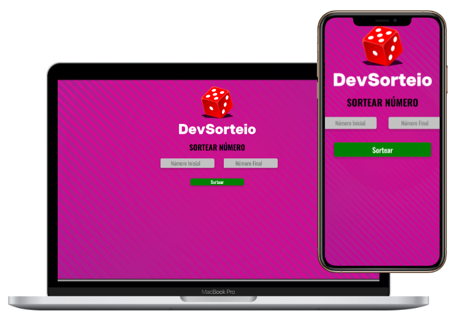

<p align="center">
  
</p>
<h1 align="center">
  Sorteador de Números
</h1>

---

Este é um projeto simples que permite ao usuário sortear um número entre dois valores fornecidos. O sistema valida se o número inicial é menor que o final e exibe o número sorteado em uma interface amigável. Feito com HTML, CSS e JavaScript, o projeto pode ser visualizado em dispositivos móveis e desktops.

## Funcionalidades

- Permite ao usuário inserir um número inicial e um número final.
- Ao clicar no botão, um número aleatório entre os valores informados é sorteado.
- Exibe o número sorteado na tela.
- Validação de input: o número inicial deve ser menor que o número final.

## Tecnologias Utilizadas

  
  


## Como Usar

1. Clone o repositório ou faça o download dos arquivos.
2. Abra o arquivo `index.html` em um navegador.
3. Insira um valor inicial e final nos campos de entrada.
4. Clique no botão "Sortear" para gerar um número aleatório entre os valores.
5. O número sorteado será exibido na tela.

## Estrutura de Diretórios

```plaintext
.
├── assets/
│   ├── css/
│   │   └── style.css         # Arquivo de estilos
│   ├── img/
│   │   ├── back2.jpg         # Imagem de fundo
│   │   └── sort-1.png        # Logo do sorteador
│   └── script/
│       └── script.js          # Lógica do sorteio
├── index.html                 # Página principal
└── README.md                  # Documentação do projeto
```

---

Desenvolvido por <b>Fabio Marques</b>, seguindo metodologia de estudos do curso <a href="https://rodolfomori.com.br/devclub-pv/">DevClub</a>